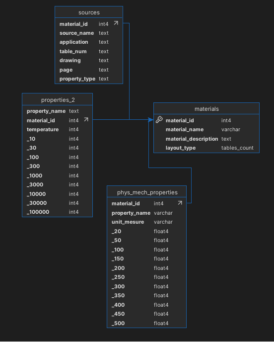

# Database viewer materials

Приложение, написанное в Winforms для просмотра данных о различных материалов и их свойствах, хранящихся в базе данных

---

## 🧱 Стек технологий

- C# 
- .NET Framework
- PostgreSQL
- Windows Forms
- Npgsql

---

### Структура проекта
 - metals_db_viewer - проект приложения
 - metals_schema.sql - скрипт создания базыданных

### Модель данных

