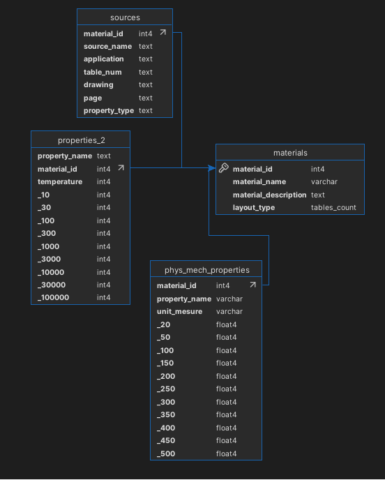
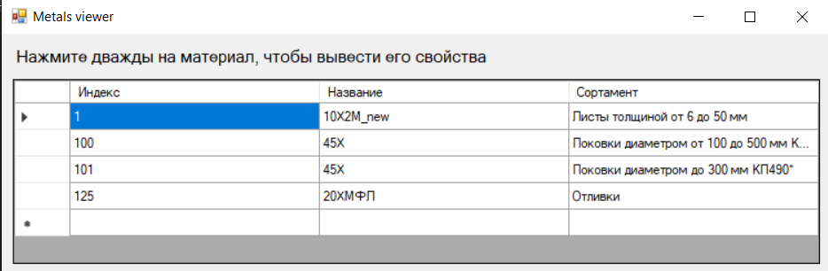
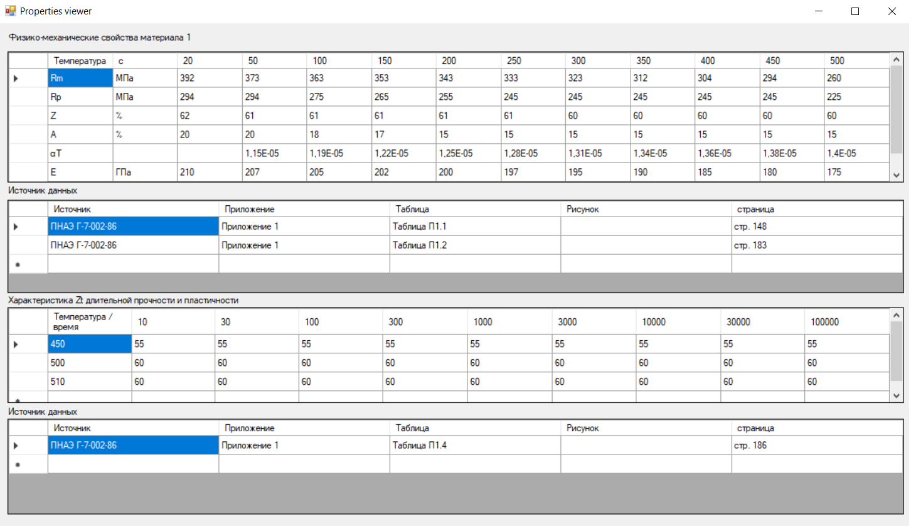

# Database viewer materials

Приложение, написанное в Winforms для просмотра данных о различных материалов и их свойствах, хранящихся в базе данных

---

## 🧱 Стек технологий

- C# 
- .NET Framework
- PostgreSQL
- Windows Forms
- Npgsql

---

### Структура проекта
 - metals_db_viewer - проект приложения
 - metals_schema.sql - скрипт создания базыданных

### Модель данных



### Пример работы программы




### Скрипт создания БД

```sql
--
-- PostgreSQL database dump
--

-- Dumped from database version 17.5
-- Dumped by pg_dump version 17.5

-- Started on 2025-07-15 16:49:31

SET statement_timeout = 0;
SET lock_timeout = 0;
SET idle_in_transaction_session_timeout = 0;
SET transaction_timeout = 0;
SET client_encoding = 'UTF8';
SET standard_conforming_strings = on;
SELECT pg_catalog.set_config('search_path', '', false);
SET check_function_bodies = false;
SET xmloption = content;
SET client_min_messages = warning;
SET row_security = off;

--
-- TOC entry 849 (class 1247 OID 16412)
-- Name: tables_count; Type: TYPE; Schema: public; Owner: postgres
--

CREATE TYPE public.tables_count AS ENUM (
    '2',
    '4',
    '5'
);


ALTER TYPE public.tables_count OWNER TO postgres;

SET default_tablespace = '';

SET default_table_access_method = heap;

--
-- TOC entry 217 (class 1259 OID 16419)
-- Name: materials; Type: TABLE; Schema: public; Owner: postgres
--

CREATE TABLE public.materials (
    material_id integer NOT NULL,
    material_name character varying(64) NOT NULL,
    material_description text,
    layout_type public.tables_count DEFAULT '2'::public.tables_count NOT NULL
);


ALTER TABLE public.materials OWNER TO postgres;

--
-- TOC entry 218 (class 1259 OID 16427)
-- Name: phys_mech_properties; Type: TABLE; Schema: public; Owner: postgres
--

CREATE TABLE public.phys_mech_properties (
    material_id integer NOT NULL,
    property_name character varying(16) NOT NULL,
    unit_mesure character varying(32),
    _20 real,
    _50 real,
    _100 real,
    _150 real,
    _200 real,
    _250 real,
    _300 real,
    _350 real,
    _400 real,
    _450 real,
    _500 real
);


ALTER TABLE public.phys_mech_properties OWNER TO postgres;

--
-- TOC entry 220 (class 1259 OID 16501)
-- Name: properties_2; Type: TABLE; Schema: public; Owner: postgres
--

CREATE TABLE public.properties_2 (
    property_name text,
    material_id integer,
    temperature integer,
    _10 integer,
    _30 integer,
    _100 integer,
    _300 integer,
    _1000 integer,
    _3000 integer,
    _10000 integer,
    _30000 integer,
    _100000 integer
);


ALTER TABLE public.properties_2 OWNER TO postgres;

--
-- TOC entry 219 (class 1259 OID 16491)
-- Name: sources; Type: TABLE; Schema: public; Owner: postgres
--

CREATE TABLE public.sources (
    material_id integer,
    source_name text,
    application text,
    table_num text,
    drawing text,
    page text,
    property_type text
);


ALTER TABLE public.sources OWNER TO postgres;

--
-- TOC entry 4657 (class 2606 OID 16426)
-- Name: materials materials_pkey; Type: CONSTRAINT; Schema: public; Owner: postgres
--

ALTER TABLE ONLY public.materials
    ADD CONSTRAINT materials_pkey PRIMARY KEY (material_id);


--
-- TOC entry 4658 (class 2606 OID 16430)
-- Name: phys_mech_properties phys_mech_properties_material_id_fkey; Type: FK CONSTRAINT; Schema: public; Owner: postgres
--

ALTER TABLE ONLY public.phys_mech_properties
    ADD CONSTRAINT phys_mech_properties_material_id_fkey FOREIGN KEY (material_id) REFERENCES public.materials(material_id);


--
-- TOC entry 4660 (class 2606 OID 16506)
-- Name: properties_2 properties_2_material_id_fkey; Type: FK CONSTRAINT; Schema: public; Owner: postgres
--

ALTER TABLE ONLY public.properties_2
    ADD CONSTRAINT properties_2_material_id_fkey FOREIGN KEY (material_id) REFERENCES public.materials(material_id);


--
-- TOC entry 4659 (class 2606 OID 16496)
-- Name: sources sources_material_id_fkey; Type: FK CONSTRAINT; Schema: public; Owner: postgres
--

ALTER TABLE ONLY public.sources
    ADD CONSTRAINT sources_material_id_fkey FOREIGN KEY (material_id) REFERENCES public.materials(material_id);


-- Completed on 2025-07-15 16:49:31

--
-- PostgreSQL database dump complete
--


```
